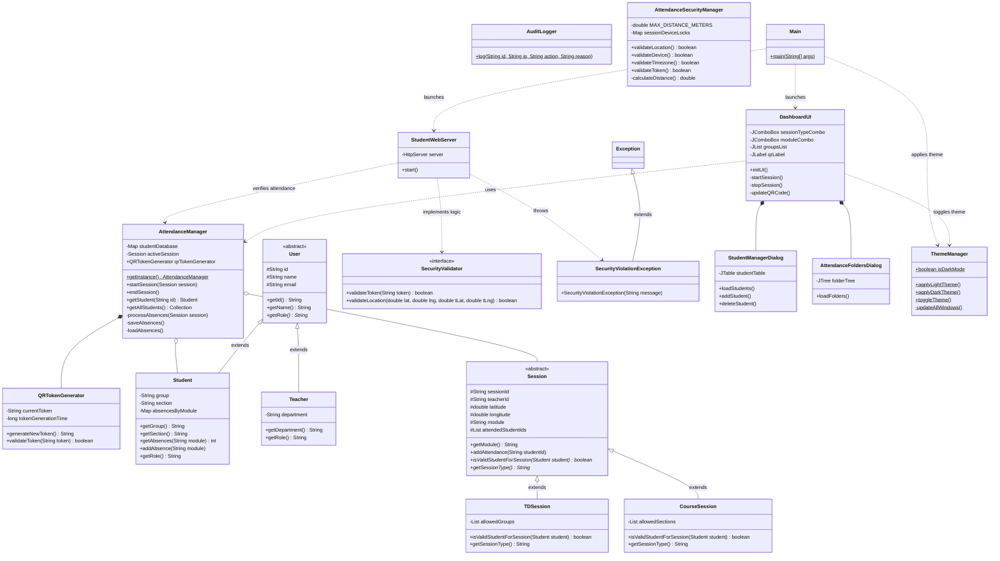

# Detailed Step-by-Step File Analysis & UML

## 1. Package: `models`
**1. User.java (Abstract Class)**
*   **Role:** This is the parent class for all people in the system.
*   **Fields:** It holds the shared data: `id`, `name`, and `email` (using `protected` so children can access them).
*   **Methods:** It has an abstract method `getRole()` that children MUST implement.

**2. Student.java**
*   **Inheritance:** `public class Student extends User`
*   **Role:** Inherits `id`, `name`, and `email` from `User`. It adds student-specific data.
*   **Fields:** `group`, `section`, and a `Map` to track absences.
*   **Methods:** It implements `getRole()` to return "Student".

**3. Teacher.java**
*   **Inheritance:** `public class Teacher extends User`
*   **Role:** Inherits `id`, `name`, and `email` from `User`. It adds teacher-specific data.
*   **Fields:** `department`.
*   **Methods:** It implements `getRole()` to return "Teacher".

**4. Session.java (Abstract Class)**
*   **Role:** The parent class for any classroom session.
*   **Fields:** `sessionId`, `teacherId`, `module`, `latitude`, `longitude`, and a list of students who attended.
*   **Methods:** Includes the abstract method `isValidStudentForSession(Student student)`.

**5. TDSession.java**
*   **Inheritance:** `public class TDSession extends Session`
*   **Fields:** `allowedGroups` (e.g., A1, B1).
*   **Methods:** Overrides `isValidStudentForSession` to check if the student belongs to the allowed groups.

**6. CourseSession.java**
*   **Inheritance:** `public class CourseSession extends Session`
*   **Fields:** `allowedSections` (e.g., SecA, SecB).
*   **Methods:** Overrides `isValidStudentForSession` to check if the student belongs to the allowed sections.

---

## 2. Package: `core`
**7. AttendanceManager.java (Singleton)**
*   **Role:** The central brain. It holds the `studentDatabase` and the `activeSession`. 
*   **Methods:** `startSession()`, `endSession()`, `processAbsences()`. It handles File I/O for `absences.txt`.

**8. QRTokenGenerator.java**
*   **Role:** Generates dynamic, expiring cryptographic tokens to stop cheating.

**9. AuditLogger.java**
*   **Role:** Appends a log of every action to `audit_log.txt`.

---

## 3. Package: `security`
**10. SecurityValidator.java (Interface)**
*   **Role:** Defines the security rules (Location, Device, Timezone, Token).

**11. SecurityViolationException.java**
*   **Inheritance:** `public class SecurityViolationException extends Exception`
*   **Role:** A custom exception thrown when a rule is broken.

**12. AttendanceSecurityManager.java**
*   **Role:** Implements the `SecurityValidator` interface and calculates GPS distance.

---

## 4. Package: `network`
**13. StudentWebServer.java**
*   **Role:** A background HTTP server that receives scans from mobile phones.

---

## 5. Package: `gui`
**14. DashboardUI.java**
*   **Role:** The main graphical window for the teacher.

**15. StudentManagerDialog.java**
*   **Role:** The popup window to view the list of students.

**16. AttendanceFoldersDialog.java**
*   **Role:** The popup window to open the CSV folders.

**17. ThemeManager.java**
*   **Role:** Manages the system-wide UI theme, allowing the teacher to toggle between Light and Dark mode.

---

## 6. Package: `default`
**18. Main.java**
*   **Role:** The entry point. It applies the UI Theme and starts the Web Server and Dashboard.

---

## UML Class Diagram (Mermaid)

