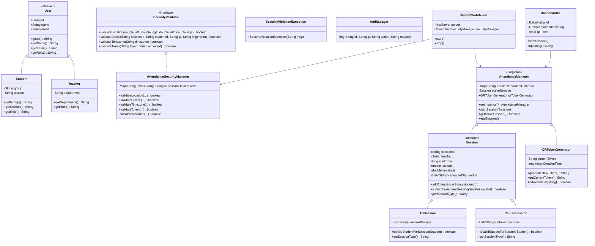

```mermaid
classDiagram

    class User {
        <<abstract>>
        #String id
        #String name
        #String email
        +getId() String
        +getName() String
        +getEmail() String
        +getRole()* String
    }

    class Student {
        -String group
        -String section
        +getGroup() String
        +getSection() String
        +getRole() String
    }

    class Teacher {
        -String department
        +getDepartment() String
        +getRole() String
    }

    User <|-- Student
    User <|-- Teacher

    class Session {
        <<abstract>>
        #String sessionId
        #String teacherId
        #long startTime
        #double latitude
        #double longitude
        #List~String~ attendedStudentIds
        +addAttendance(String studentId)
        +isValidStudentForSession(Student student)* boolean
        +getSessionType()* String
    }

    class TDSession {
        -List~String~ allowedGroups
        +isValidStudentForSession(Student) boolean
        +getSessionType() String
    }

    class CourseSession {
        -List~String~ allowedSections
        +isValidStudentForSession(Student) boolean
        +getSessionType() String
    }

    Session <|-- TDSession
    Session <|-- CourseSession

    class SecurityValidator {
        <<interface>>
        +validateLocation(double lat1, double lng1, double lat2, double lng2) boolean
        +validateDevice(String sessionId, String studentId, String ip, String fingerprint) boolean
        +validateTimezone(String timezone) boolean
        +validateToken(String token, String expected) boolean
    }

    class AttendanceSecurityManager {
        -Map~String, Map~String, String~~ sessionDeviceLocks
        +validateLocation(...) boolean
        +validateDevice(...) boolean
        +validateTimezone(...) boolean
        +validateToken(...) boolean
        -calculateDistance(...) double
    }

    SecurityValidator <|.. AttendanceSecurityManager

    class SecurityViolationException {
        +SecurityViolationException(String msg)
    }

    class AttendanceManager {
        <<Singleton>>
        -Map~String, Student~ studentDatabase
        -Session activeSession
        +QRTokenGenerator qrTokenGenerator
        +getInstance() AttendanceManager
        +startSession(Session)
        +getActiveSession() Session
        +endSession()
    }

    class QRTokenGenerator {
        -String currentToken
        -long tokenCreationTime
        +generateNewToken() String
        +getCurrentToken() String
        +isTokenValid(String) boolean
    }

    class AuditLogger {
        +log(String id, String ip, String action, String reason)
    }

    class StudentWebServer {
        -HttpServer server
        -AttendanceSecurityManager securityManager
        +start()
        +stop()
    }

    class DashboardUI {
        -JLabel qrLabel
        -JTextArea attendanceLog
        -Timer qrTimer
        +startSession()
        +updateQRCode()
    }

    AttendanceManager o-- Session
    AttendanceManager o-- QRTokenGenerator
    StudentWebServer --> AttendanceManager
    StudentWebServer --> AttendanceSecurityManager
    DashboardUI --> AttendanceManager
```
