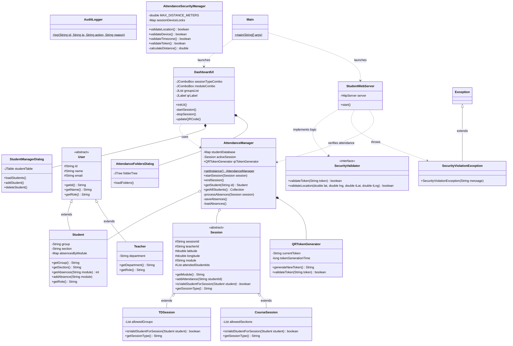

# Technical Report: Secure Attendance Management System

**Author:** System Architect
**Project:** Secure Java-based QR Attendance System
**Date:** May 2026

---

## 1. Introduction
The Secure Attendance Management System is a comprehensive, standalone desktop application built entirely in Java. Its primary objective is to modernize the academic attendance tracking process by replacing manual roll calls with a secure, dynamic QR code scanning system. 

Designed for scalability and robustness, the application allows teachers to initiate distinct class sessions (such as "Course" or "TD" sessions) tailored to specific groups or sections and subjects. Students can mark their presence by scanning a dynamically generated QR code using their mobile devices over local Wi-Fi or 4G/5G networks (via secure tunneling).

To ensure academic integrity, the system implements strict security protocols including time-sensitive cryptographic tokens, GPS geolocation validation, and automated exclusion logic for students who exceed absence limits.

---

## 2. System Architecture & Modular Design

The application follows a strictly modular architecture, separating concerns into four distinct packages. This ensures that the codebase is maintainable, scalable, and adheres to the Single Responsibility Principle (SRP).

### 2.1 Package Breakdown
1. **`models`**: Contains the core data structures (`User`, `Student`, `Teacher`, `Session`). It defines the entities that the application manipulates.
2. **`core`**: Contains the business logic and state management (`AttendanceManager`, `QRTokenGenerator`). It acts as the bridge between the UI and the underlying data.
3. **`network`**: Manages all external communication and security (`StudentWebServer`, `SecurityValidator`, `SecurityViolationException`). It handles HTTP requests from mobile devices.
4. **`gui`**: Contains the graphical user interface components built with Java Swing (`DashboardUI`, `StudentManagerDialog`, `AttendanceFoldersDialog`).

This modularity allows developers to modify the GUI without affecting the underlying web server, or update the database logic without touching the UI components.

---

## 3. Object-Oriented Principles Applied

The project is a textbook implementation of advanced Object-Oriented Programming (OOP) paradigms. It successfully integrates at least 14 distinct classes and interfaces.

### 3.1 Inheritance
Inheritance is used to establish "is-a" relationships, reducing code duplication and enforcing a clear hierarchy.
*   **The User Hierarchy**: An abstract `User` class holds common properties (`id`, `name`, `email`). Both `Student` and `Teacher` inherit from `User`. The `Student` class expands on this by adding academic specific fields such as `group`, `section`, and an absences tracker map.
*   **The Session Hierarchy**: An abstract `Session` class defines the blueprint for an active class (tracking the module, teacher, coordinates, and timestamp). The subclasses `TDSession` and `CourseSession` inherit from `Session`.

### 3.2 Interfaces
The `SecurityValidator` interface defines a strict contract for validating incoming attendance requests. By programming to an interface, the `StudentWebServer` does not need to know *how* a token is validated, only that it *can* be validated. This allows for future implementation of different security strategies (e.g., biometric validation) without rewriting the server logic.

### 3.3 Polymorphism
Polymorphism is heavily utilized in the session validation logic. The abstract `Session` class declares an abstract method:
```java
public abstract boolean isValidStudentForSession(Student student);
```
When `AttendanceManager` attempts to validate a student, it calls this method. If the active session is a `TDSession`, the method validates the student against a list of specific **Groups**. If it is a `CourseSession`, it validates against **Sections**. The server calls the same method regardless of the session type, allowing the Java runtime to dynamically resolve the correct logic.

### 3.4 Custom Exception Handling
To manage specific academic infractions, the system defines a custom exception: `SecurityViolationException` which inherits from Java's base `Exception` class.
When a student attempts to scan a QR code from outside the classroom or uses an expired token, the server explicitly throws this exception:
```java
if (distance > 50) {
    throw new SecurityViolationException("Location check failed: Student is " + distance + " meters away.");
}
```
This exception is caught by a global error handler which prevents the server from crashing and safely logs the infraction.

---

## 4. Security Mechanisms

A major focus of this application is preventing attendance fraud.

### 4.1 Dynamic Token Generation
Static QR codes can be easily photographed and shared with absent students. To combat this, the `QRTokenGenerator` creates a unique cryptographic token every 30 seconds. The web server validates the incoming token against the currently active token in memory. If a student attempts to use a token that is older than 30 seconds, the system throws a `SecurityViolationException`.

### 4.2 Geolocation Validation
When the student scans the QR code, the mobile web interface captures their device's GPS coordinates. The `StudentWebServer` uses the Haversine formula to calculate the exact distance between the student's mobile device and the teacher's classroom coordinates. If the distance exceeds 50 meters, the attendance is rejected.

### 4.3 Automated Exclusion Logic
The system enforces attendance policies dynamically. Absences are tracked on a per-module basis using the Java Collections Framework (specifically `HashMap<String, Integer>`). When a student attempts to mark attendance, the server verifies their absence record for the currently active module:
```java
if (student.getAbsences(activeSession.getModule()) > 2) {
    throw new SecurityViolationException("Student is excluded from " + activeSession.getModule() + " due to >2 absences.");
}
```

---

## 5. Data Persistence & File I/O

The application ensures that no data is lost when the software is closed. It utilizes standard Java File I/O (`FileWriter`, `PrintWriter`, `Scanner`) for robust data persistence.

1.  **Attendance Sheets (CSV)**: When a session ends, the `AttendanceManager` iterates through the list of attended students and automatically generates a CSV file organized into directories based on the Group/Section (`attendance_data/A1/attendance_S12345.csv`).
2.  **Absence Tracking**: The `absences.txt` file acts as a persistent database for tracking missed classes. It maps the Student ID, the specific Module, and the total absence count. This file is parsed on application startup to restore state.
3.  **Audit Logs**: Every successful attendance mark and every blocked attempt is securely appended to `audit_log.txt` with a timestamp and IP address.
4.  **Exclusions**: Students who reach the absence threshold are permanently logged to `excluded_students.txt`.

---

## 6. Graphical User Interface (GUI)

The teacher dashboard is built using **Java Swing**. To ensure a modern, professional, and "human-friendly" experience, the default Java look-and-feel was completely overhauled via the `UIManager`.

*   **Typography & Colors**: The UI utilizes the "Segoe UI" font globally for high readability, accompanied by a clean Light Gray/Blue/White color palette.
*   **Feedback & Interactions**: Action buttons utilize intuitive color coding (Green for Start, Red for Stop) and interactive hand-cursors on hover.
*   **Dynamic Displays**: The dashboard features live updates, rendering the dynamically generated QR code visually and updating a live-scrolling log of attended students via background timers.

---

## 7. UML Class Diagram

The structural architecture of the application is mapped out below:



---

## 8. Conclusion
The Secure Attendance Management System successfully modernizes classroom tracking by marrying traditional desktop application stability with modern web-server accessibility. By strictly adhering to Object-Oriented Principles, the system achieves a highly modular, extensible, and secure codebase that is fully prepared to scale into a production environment.
